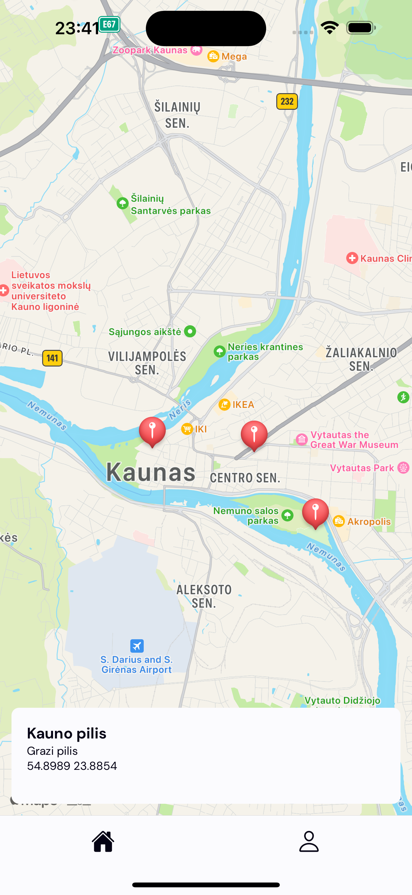
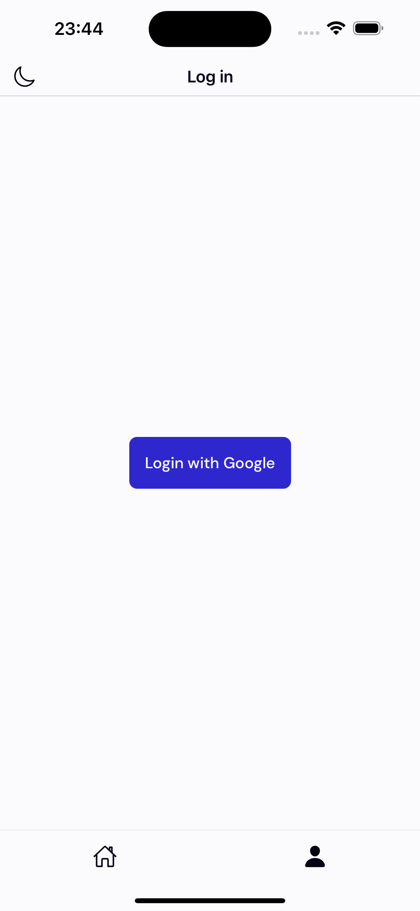
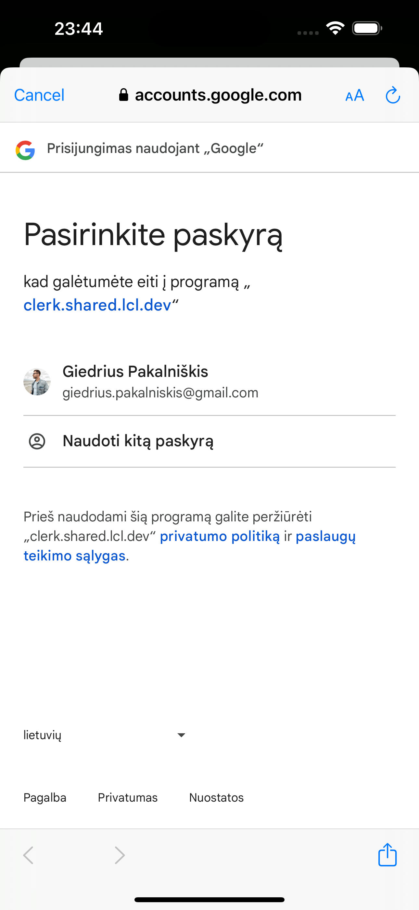
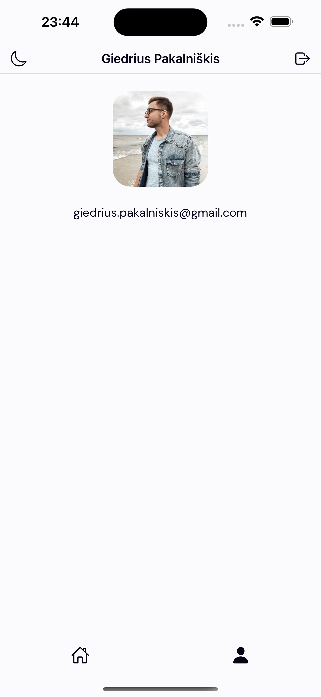
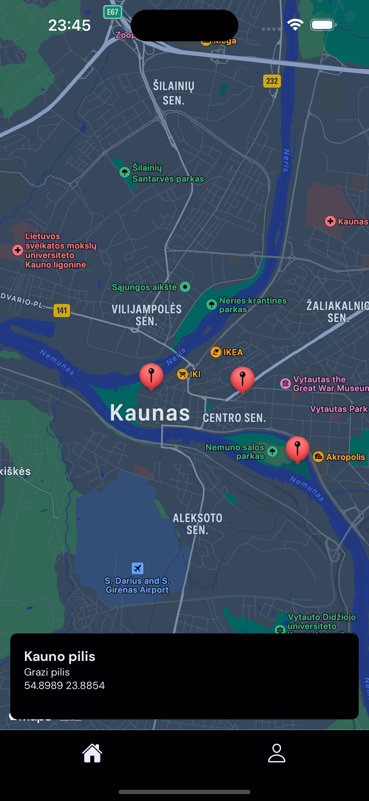
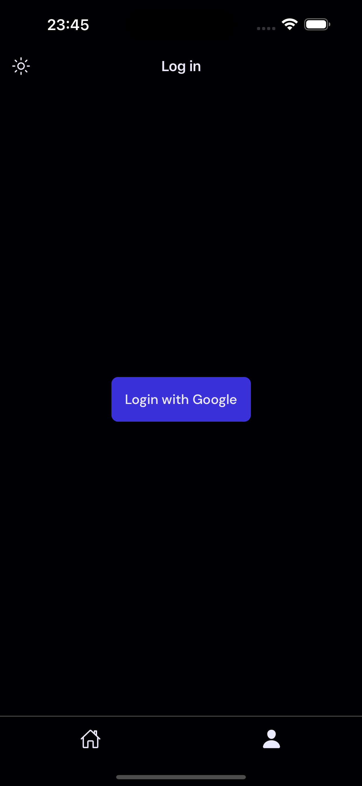
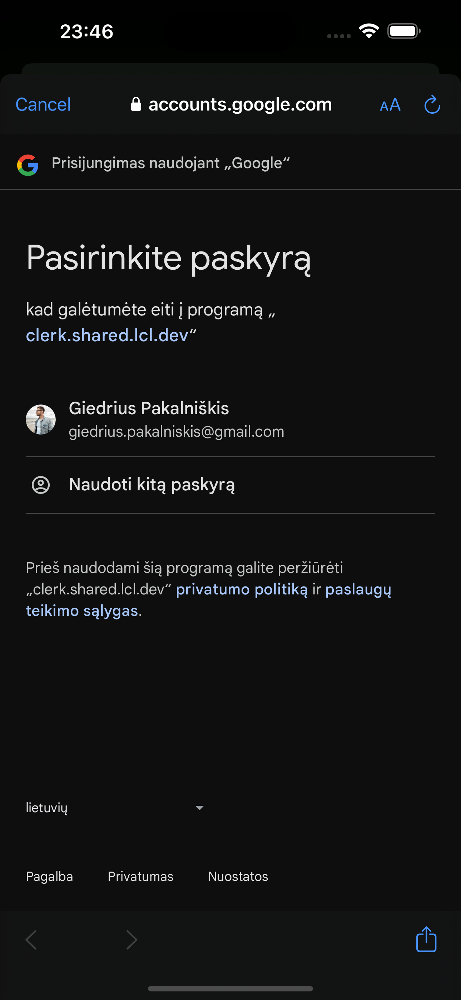
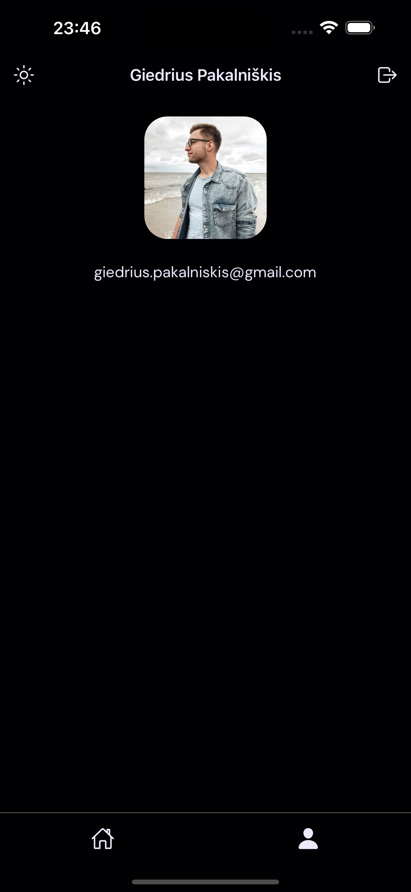

# 🗺️ Expi App  

A simple learning-oriented mobile app built with [**Expo**](https://expo.dev/), showcasing features like map rendering, data fetching from a [**Convex**](https://www.convex.dev/) database, and user authentication via [**Clerk**](https://clerk.com/), synchronized with database.

## Table of Contents  
- [Features](#features)  
- [Tech Stack](#tech-stack)  
- [Screenshots](#screenshots)  

## Features  
- **Map Screen**:  
  - Displays a map with markers where data is fetched in real-time from a **Convex** database.  
- **Profile Screen**:  
  - **Logged Out**: Displays a login button for user authentication with Google account.  
  - **Logged In**: Shows the user's profile image, name, and email.  
- **Social Authentication**:  
  - Log in with Google via **Clerk**, with user data automatically synced to **Convex** database.  
- **Navigation**:  
  - Tabs navigation made with **Expo Router**.

## Tech Stack  
- **Framework**: Expo, React Native
- **Navigation**: Expo Router  
- **Database & API**: Convex  
- **Authentication**: Clerk

## Screenshots
- **Light Theme**
    
         
    
- **Dark Theme** 
    
     
